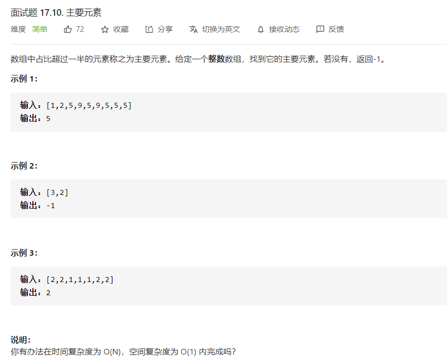

# 题目描述



## 想要时间复杂度满足为O(N),空间复杂度O(1)可以采用摩尔投票算法！
**重点：**首先请考虑最基本的摩尔投票问题，找出一组数字序列中出现次数大于总数1/2的数字（并且假设这个数字一定存在）。显然这个数字只可能有一个。摩尔投票算法是基于这个事实：每次从序列里选择两个不相同的数字删除掉（或称为“抵消”），最后剩下一个数字或几个相同的数字，就是出现次数大于总数一半的那个。

### 代码

```java
public static int majorityElement2(int[] nums){
        int temp = nums[0];
        int count = 1;
        for (int i = 1; i < nums.length; i++) {
            if (nums[i] == temp) {
                count++;
            } else {
                count--;
            }
            if (count == 0) {
                temp = nums[i];
                count = 1;
            }
        }
        count=0;
        for(int num:nums){
            if(num==temp) count++;
            if(count==nums.length/2+1) return temp;
        }
        return -1;
    }
```

由于该题数组可能不存在出现次数大于总数1/2的数字,后面再遍历一次判断一下该数是否大于数组的一半！